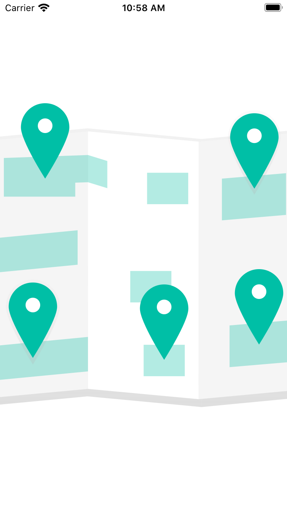
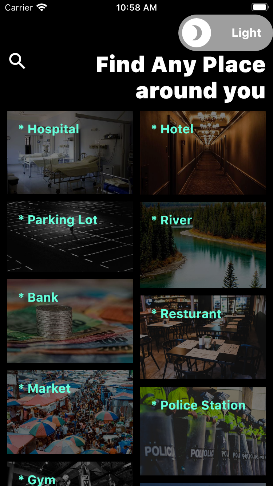
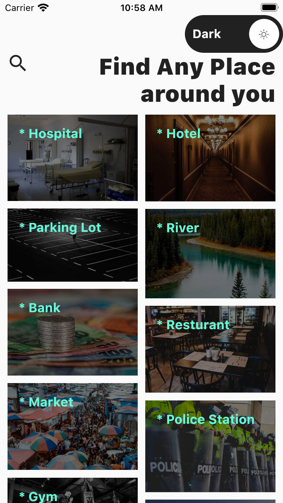
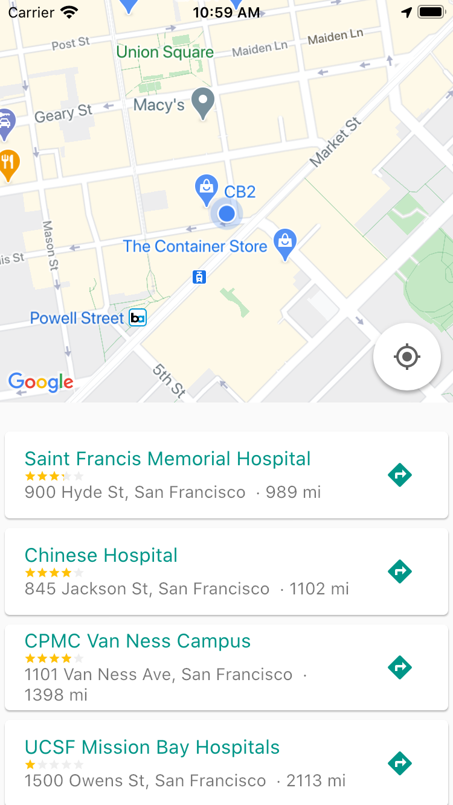
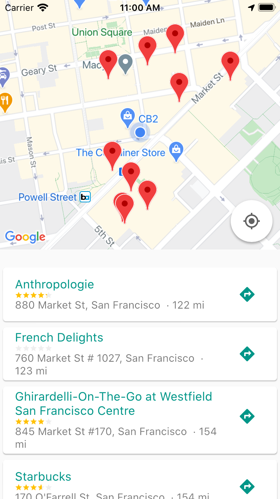
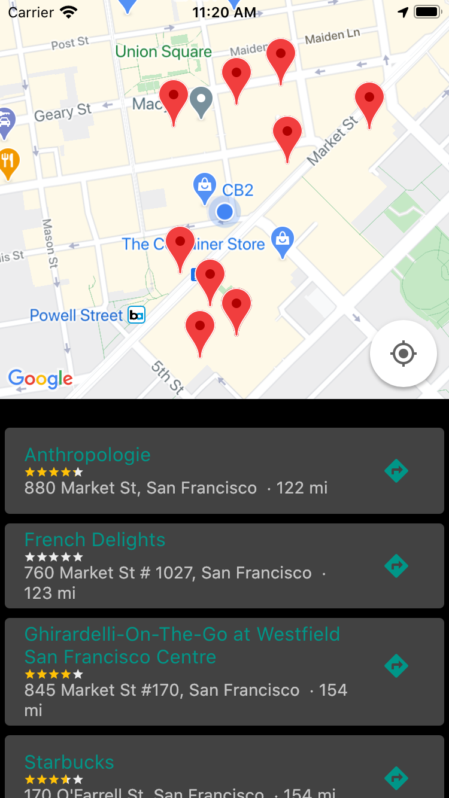

# find_places

A Flutter project.

## About find_places

this app helps find places around you
it display the first 20 closest result, it has a wide range of options to pick from and it also allows users search for places not included in the options

