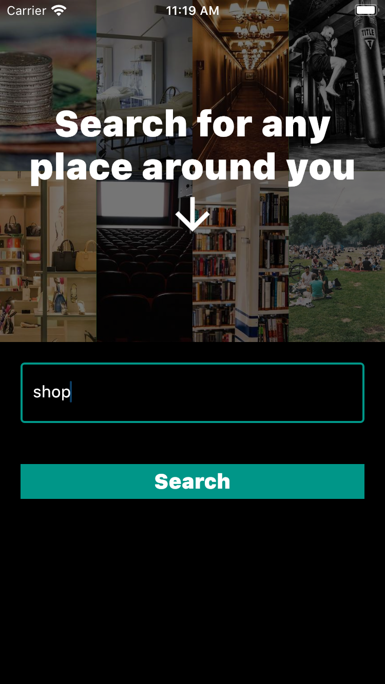

# find_places

A Flutter project.

## About find_places

this app helps find places around you.
it display the first 20 closest result, it has a wide range of options to pick from and it also allows users search for places not included in the options.

## Instructions

for it to work on an andriod device enter your google api key in the AndroidManifest.xml line 47
PATH: find_places/android/app/src/main/AndroidManifest.xml

for it to work on an ios device enter your google api key in the AppDelegate.swift line 11
PATH: find_places/ios/Runner/AppDelegate.swift

## images

